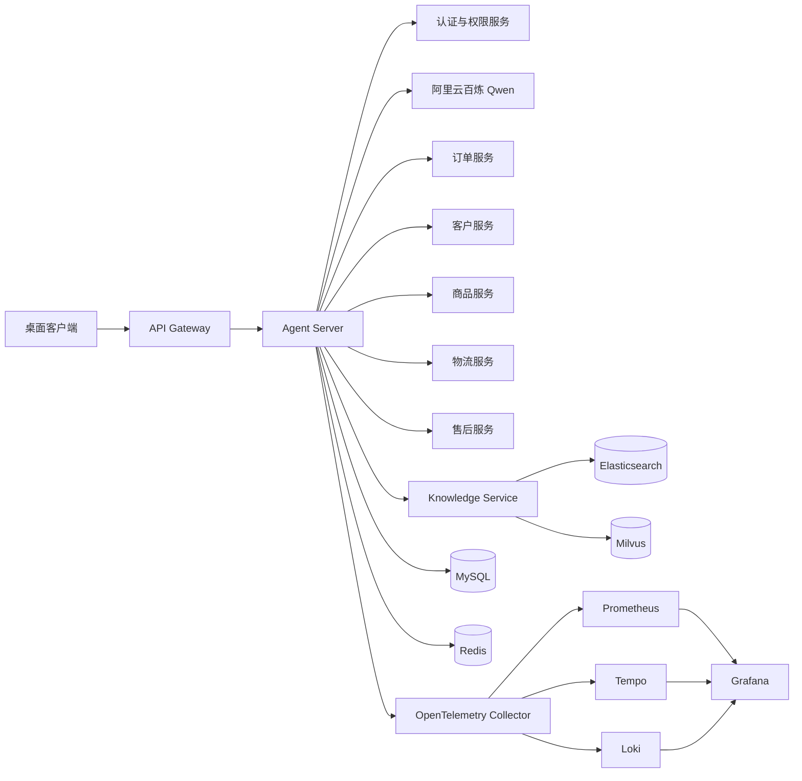

# 享佳智能坐席助手 · Agent Server

`order-logistics-agent-server` 是享佳智能坐席助手的核心后端服务，面向企业内部客服坐席提供订单、客户、商品、物流和售后业务查询能力，并结合企业知识库生成有依据、可追溯、受权限约束的处理建议。

项目采用 Spring AI 承担模型交互与 Function Calling，使用 LangGraph4j 编排多分支复合查询，通过 SSE 输出增量文本和结构化业务卡片。系统坚持“业务事实来自受控工具、规则结论来自已发布知识、模型不直接访问数据库”的设计边界。

## 核心能力

- **受控业务查询**：封装订单、客户、商品、物流和售后查询工具，身份、租户及组织范围由服务端注入，模型不能修改权限参数。
- **复合问题编排**：使用 LangGraph4j 状态图组织输入校验、分支分发、业务查询、知识查询、结果校验和答案组装。
- **并行与依赖执行**：无依赖分支并行调度；“客户最近订单 → 物流查询”等存在数据依赖的分支按拓扑顺序执行。
- **Checkpoint 恢复**：使用 Redis 保存工作流安全快照，异常中断后只执行未完成节点，避免重复调用已成功的下游服务。
- **SSE 流式交互**：输出会话、状态、文本增量、结构化结果、错误和完成事件，支持心跳、主动取消、状态查询及断线续传。
- **业务结果门禁**：对工具结果进行结构校验、空结果短路和新鲜度校验，禁止模型根据历史消息或不完整结果推断实时业务事实。
- **企业知识检索**：调用独立 Knowledge Service，使用 Elasticsearch BM25 与 Milvus 向量召回、RRF 融合和模型重排返回已发布知识证据。
- **故障保护**：对下游调用配置超时、有限重试、熔断和安全降级，区分业务拒绝、不可重试错误及瞬时基础设施故障。
- **记忆与上下文**：MySQL 保存会话及记忆事实，Redis 承担活跃状态与加速；跨会话记忆支持显式管理、自动提取和语义召回。
- **评测与观测**：离线 Golden Case 覆盖正常、空结果、下游失败、并行分支和恢复场景；运行时提供指标、Trace、日志、看板和告警。

## 系统架构



### 模型分工

| 模型 | 用途 |
|---|---|
| `qwen-plus` | 主对话、意图理解、工具调用、复合答案组装、会话摘要和记忆提取 |
| `qwen3.7-text-embedding` | 企业知识及用户记忆的向量化 |
| `qwen3.7-text-rerank` | 对关键词与向量召回后的候选证据进行重排 |

Agent Server 通过 Spring AI 的 OpenAI 兼容接口接入百炼模型。Embedding 和 Reranker 由 Knowledge Service 统一管理，避免业务服务直接感知模型供应商协议。

## LangGraph4j 复合查询

复合查询使用六个稳定节点构建状态图：

```text
START
  → input.validate
  → branch.dispatch
  → business.query ─┐
  → knowledge.query ├→ result.validate
                    └→ answer.compose
                       → END
```

- `input.validate`：提取并校验查询所需业务标识。
- `branch.dispatch`：根据查询计划确定业务、知识和依赖分支。
- `business.query`：执行受权限约束的实时业务查询。
- `knowledge.query`：检索与问题匹配的已发布企业知识。
- `result.validate`：执行空结果、结构化结果和知识引用门禁。
- `answer.compose`：把已验证事实和知识证据交给模型生成最终回答。

节点只返回状态增量，由 LangGraph4j 按 State Channel 合并。图输入、分支快照和 Checkpoint 均使用受控 DTO，不保存访问令牌、完整提示词或敏感业务载荷。

## Spring AI 与工具边界

Spring AI 负责模型流式调用和 Function Calling；LangGraph4j 负责确定节点顺序、并行关系、依赖关系和恢复位置。模型只能看到本轮允许使用的窄口径工具：

- 订单及订单明细查询；
- 客户订单查询；
- 商品与 SKU 查询；
- 物流轨迹和停滞评估查询；
- 售后工单查询；
- 企业知识检索。

所有工具调用都经过统一保护器，支持同参复用、调用次数限制、超时控制、结果暂存和审计。不存在的订单、客户或 SKU 会在业务结果门禁处直接结束，不继续调用知识库生成无依据解释。

## SSE 与断线恢复

首次请求通过 `POST /api/v1/chat/stream` 建立 SSE 通道。服务端为每轮请求分配 `requestId` 和递增事件序号，并输出以下事件类型：

| 事件 | 说明 |
|---|---|
| `session` | 会话、请求及恢复元数据 |
| `status` | 可公开的处理进度 |
| `delta` | 模型生成的增量文本 |
| `result` | 订单卡片、物流时间线、商品列表或知识引用 |
| `error` | 稳定错误码和安全提示 |
| `done` | 本轮终态 |

可恢复模式下，事件同步写入 Redis Streams。客户端断线后携带 `requestId` 和最后消费的序号访问恢复接口，服务端只补发后续事件，不重新创建 Agent 任务。

主要接口：

```text
POST /api/v1/chat/stream
GET  /api/v1/chat/stream/{requestId}/resume
GET  /api/v1/chat/stream/{requestId}/status
POST /api/v1/chat/stream/{requestId}/cancel
```

## 可靠性设计

- OpenFeign 负责访问内部业务服务，连接地址和超时由 Nacos 集中管理。
- Resilience4j 为订单、客户等下游提供独立的 TimeLimiter 和 Circuit Breaker。
- 仅对明确的瞬时网络错误和部分服务端错误进行有限重试，不重试参数错误、权限拒绝和确定性业务失败。
- 模型流在首个有效增量前允许有限重试；开始向客户端输出后不自动重放整轮回答。
- Redis 不可用时关闭 SSE 回放和 Checkpoint 恢复能力，但不把缓存数据当作业务事实。
- 业务分支部分失败时只返回已验证结果，并明确缺失范围，不推断丢失、赔付或责任结论。

## 安全边界

- 客户端只提交访问令牌和业务查询参数，不提交租户及组织权限范围。
- 服务端重新解析可信身份，并将 `companyId` 映射为内部 `tenantId`。
- 工具层再次执行租户、用户和组织边界校验，模型不能生成自由 SQL。
- 密钥、令牌、Cookie、完整 Prompt、用户原文和工具载荷禁止写入 Prometheus 标签。
- 业务卡片与模型视图分离；前端结构化结果由服务端 DTO 驱动，不执行模型生成的 HTML 或组件名称。
- 所有密钥只通过环境变量、密钥管理系统或受控配置中心注入。

## 技术栈

| 类别 | 技术 |
|---|---|
| 基础框架 | Java 21、Spring Boot 3.5、Spring Cloud、Spring Cloud Alibaba |
| AI 与编排 | Spring AI 1.1、LangGraph4j 1.8、阿里云百炼 Qwen |
| 服务调用 | OpenFeign、Resilience4j |
| 数据访问 | MyBatis-Plus、MySQL、Flyway |
| 状态与消息 | Redis、RabbitMQ |
| 知识检索 | Elasticsearch、Milvus、RRF、Embedding、Reranker |
| 配置中心 | Nacos |
| 流式协议 | HTTP SSE、Redis Streams |
| 可观测性 | Micrometer、Prometheus、Grafana、OpenTelemetry、Tempo、Loki、Alertmanager |
| 工程化 | Maven、Docker Compose、JUnit 5、Testcontainers |

## 工程结构

```text
src/main/java/com/xjjk/agent
├─ auth          登录与令牌刷新
├─ identity      可信身份解析
├─ tenant        租户上下文
├─ chat          对话、SSE、编排、Checkpoint 与回答门禁
├─ order         订单和物流业务工具
├─ customer      客户查询工具
├─ product       商品查询工具
├─ aftersale     售后查询工具
├─ knowledge     企业知识检索网关
├─ memory        用户记忆、异步提取及索引任务
├─ prompt        Prompt 与工具目录配置
├─ integration   下游调用与统一观测
├─ tool          工具调用保护器
└─ common        公共错误、Web 和安全基础能力

infra/observability
├─ collector     OpenTelemetry Collector
├─ prometheus    指标采集与告警规则
├─ grafana       数据源和业务看板
├─ tempo         Trace 存储
├─ loki          日志存储
└─ alertmanager  告警路由
```

